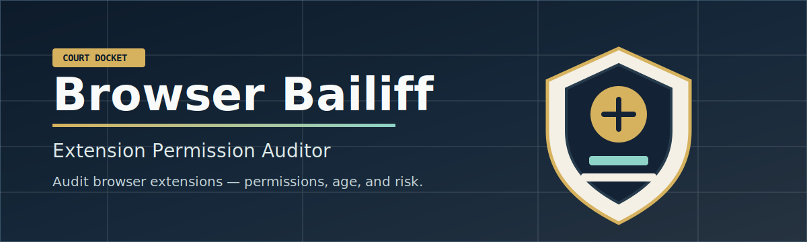
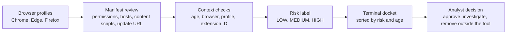

# Browser Bailiff

Audit browser extensions before quiet permissions become operational risk.

Browser Bailiff is a read-only Python tool for reviewing installed Chrome, Edge,
and Firefox extensions from the command line.

It extracts manifest metadata, summarizes permissions and host access, flags
stale or powerful extensions, prints a human-readable docket, and can write JSON
output for later review.

Browser Bailiff's theme is a court bailiff: orderly, direct, and focused on the
record. Extensions are not presumed bad; they are called to the docket, their
requested access is read aloud, and the operator gets a concise finding for
review.


## At A Glance

- Read-only audit tool; it does not install, disable, or delete extensions.
- Scans Chrome, Edge, and Firefox extension directories on Windows, macOS, and Linux.
- Reads Chromium `manifest.json` files and Firefox `.xpi` archives.
- Resolves localized Chromium extension names when possible.
- Reports browser profile, extension ID, version, permissions, host access, update URL, path, and age.
- Includes content-script host matches and optional permissions in the JSON output.
- Scores extension risk as `LOW`, `MEDIUM`, or `HIGH` with a finding reason.
- Sorts the terminal docket by risk and age.
- Ships with tests, CI, a security policy, and versioned releases.

## The Docket

Browser Bailiff is built around three review questions:

- `What extensions are installed?`
- `What browser data or sites can they touch?`
- `Which findings deserve a closer look?`

The wording stays plain on purpose. A `HIGH` finding is not a verdict; it is a
reason to review the extension's access, age, source, and business need.

## Review Flow



## Why It Exists

Browser extensions sit close to sensitive user activity. Some can read or modify
pages, inspect cookies, communicate with native applications, or manage other
extensions. Those powers may be legitimate, but they deserve visibility.

Browser Bailiff helps answer:

> Which browser extensions are installed, what can they access, and which ones deserve closer review?

## What It Checks

On Chromium-based browsers:

- Chrome profile extension folders
- Edge profile extension folders
- Latest version folder for each extension ID
- `manifest.json`, localized names, declared permissions, host permissions, content-script matches, and optional permissions

On Firefox:

- Firefox profile extension folders
- `.xpi` extension archives
- Extracted extension folders
- WebExtension manifests and likely legacy non-WebExtension add-ons

## Usage

Install from a clone:

```bash
git clone https://github.com/srkyn/browser-bailiff.git
cd browser-bailiff
pip install .
```

Run a scan:

```bash
bb                          # short alias
browser-bailiff             # full name
bb -b edge                  # scan Edge only
bb -b firefox -o results.json
bb --version
```

Supported browser values are `chrome`, `edge`, `firefox`, and `all`.

## Short Flags

| Short | Long | Description |
|---|---|---|
| `-b BROWSER` | `--browser BROWSER` | Browser to scan (default: `all`) |
| `-o FILE` | `--output FILE` | Write JSON results to FILE |
| `-n` | `--no-json` | Disable JSON output |

## Risk Rules

The auditor marks an extension as `HIGH` when:

- It requests sensitive permissions such as `cookies`, `<all_urls>`, `webRequest`, `nativeMessaging`, `management`, `debugger`, or `webRequestBlocking`.
- Its extension file or folder appears older than 365 days.
- It appears to be a legacy Firefox add-on.
- Its extension ID matches the built-in sample block list.

The auditor marks an extension as `MEDIUM` when:

- It requests moderate permissions such as `storage`, `tabs`, `history`, `downloads`, `bookmarks`, `proxy`, `scripting`, or `clipboardRead` without broad host control.
- It lists sensitive permissions as optional permissions.

Everything else is marked `LOW`.

These findings are triage signals, not proof of malicious behavior.

## Output Fields

JSON output includes browser, profile, extension ID, name, version, permissions,
declared permissions, host permissions, content-script matches, optional
permissions, update URL, last modified timestamp, age in days, risk, risk
reasons, path, and Firefox legacy status.

## Files

- `browser_bailiff.py`: the scanner CLI
- `tests/test_browser_bailiff.py`: unit tests for parsing and scoring behavior
- `CHANGELOG.md`: release history
- `SECURITY.md`: vulnerability reporting guidance
- `pyproject.toml`: local package metadata and CLI entry point

## Limitations

The built-in block list is intentionally small and demonstrative. Connect it
to trusted intelligence or an organization-approved allow/block list before
using Browser Bailiff for formal enforcement.

- It does not prove whether an extension is malicious.
- It does not modify browser configuration.
- It may miss extensions in profiles the current user cannot read.
- It does not resolve every browser localization edge case.
- It does not inspect extension source code behavior beyond manifest metadata.

## Validation

```bash
python -m py_compile browser_bailiff.py
python -m unittest discover -s tests -v
bb --version
bb --browser edge --no-json
```
