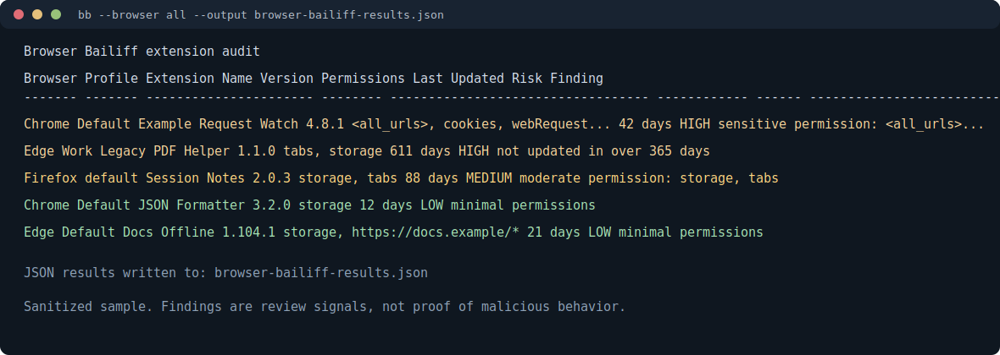

# Browser Bailiff Demo

This demo uses sanitized extension names and paths. It shows the kind of output
Browser Bailiff produces without exposing a real browser profile.



## What To Notice

- Higher-risk extensions sort to the top.
- The `Finding` column explains why an item needs review.
- The same scan can write JSON for records, tickets, or follow-up analysis.

## Example Command

```bash
bb --browser all --output browser-bailiff-results.json
```

## Example Interpretation

The first row is not labeled malicious. It is labeled `HIGH` because broad host
access and sensitive permissions deserve human review. The operator still needs
to check source, business need, publisher, and whether the extension is expected
on that machine.
